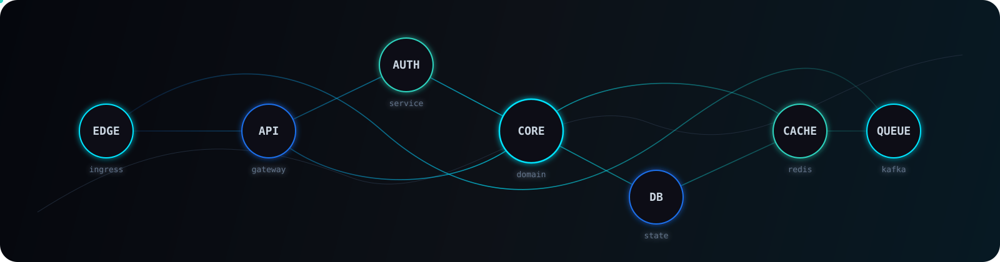
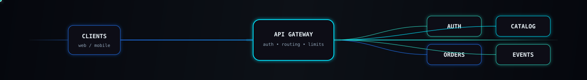
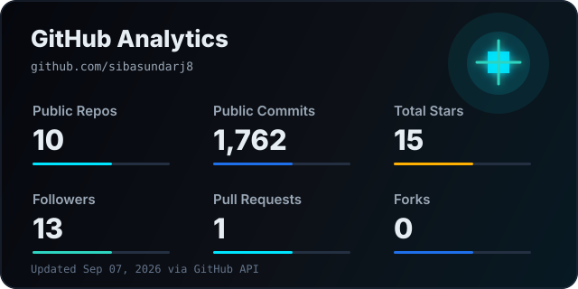
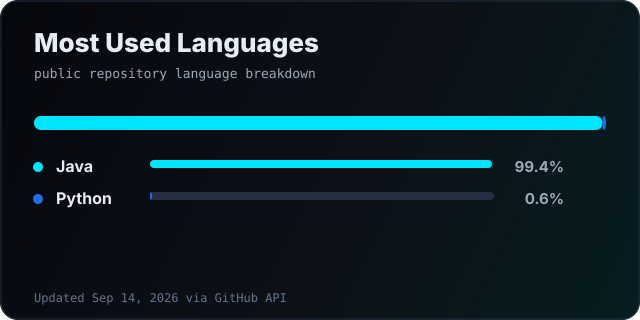
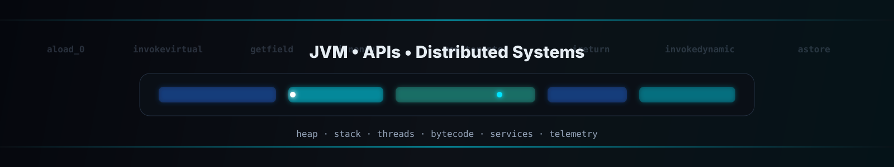

<!--
  GitHub Profile README
  Profile links wired for:
  - GitHub: https://github.com/sibasundarj8
  - LeetCode: https://leetcode.com/u/Sibasundarj8/
  - GeeksforGeeks: https://www.geeksforgeeks.org/profile/sibasundarj8?tab=activity

  Optional customizations:
  - Add email, LinkedIn, or portfolio badges if you want them visible.
  - Replace the functional project category cards with exact repo cards once you pick featured repositories.
  - Generated profile assets refresh weekly, and third-party cards use dynamic SVG URLs where possible.
-->

<p align="center">
  
</p>

<p align="center">
  <a href="https://github.com/sibasundarj8">
    
  </a>
</p>

<p align="center">
  <a href="https://github.com/sibasundarj8"></a>
  <a href="https://leetcode.com/u/Sibasundarj8/"></a>
  <a href="https://www.geeksforgeeks.org/profile/sibasundarj8?tab=activity"></a>
  <a href="https://github.com/sibasundarj8?tab=repositories"></a>
</p>

<p align="center">
  
</p>

## About Me

I am a backend/software engineer focused on designing systems that are reliable under load, observable in production, and clean enough for teams to evolve without fear.

```text
backend profile
├─ language/runtime       Java, JVM internals, concurrency
├─ application layer      Spring Boot, REST APIs, validation, security
├─ data layer             PostgreSQL, Redis, indexing, caching
├─ distributed systems    Kafka, microservices, orchestration, resilience
├─ cloud/platform         Docker, Kubernetes, AWS, Linux
└─ engineering habits     system design, DSA, testing, observability
```

<table>
  <tr>
    <td width="50%">
      <strong>Engineering Bias</strong><br />
      Simple interfaces, strong contracts, measurable reliability, and pragmatic architecture.
    </td>
    <td width="50%">
      <strong>Product Bias</strong><br />
      APIs that are easy to integrate, services that are easy to operate, and code that is easy to own.
    </td>
  </tr>
</table>

<p align="center">
  
</p>

<p align="center">
  
</p>

## Tech Stack

<!-- Keep this stack focused. Add only technologies you can discuss confidently in interviews. -->

<table>
  <tr>
    <td align="center" width="96">
      <br />Java
    </td>
    <td align="center" width="96">
      <br />Spring Boot
    </td>
    <td align="center" width="96">
      <br />PostgreSQL
    </td>
    <td align="center" width="96">
      <br />Redis
    </td>
    <td align="center" width="96">
      <br />Kafka
    </td>
    <td align="center" width="96">
      <br />Docker
    </td>
  </tr>
  <tr>
    <td align="center" width="96">
      <br />Kubernetes
    </td>
    <td align="center" width="96">
      <br />AWS
    </td>
    <td align="center" width="96">
      <br />Linux
    </td>
    <td align="center" width="96">
      <br />Git
    </td>
    <td align="center" width="96">
      <br />IntelliJ
    </td>
    <td align="center" width="96">
      <br />Bash
    </td>
  </tr>
</table>

<details>
  <summary><strong>Core Backend Capabilities</strong></summary>
  <br />

  - Java, Spring Boot, Spring MVC, Spring Data JPA, validation, exception handling
  - REST API design, authentication, authorization, pagination, idempotency
  - Microservices, service boundaries, API gateways, async messaging
  - PostgreSQL schema design, indexing, transactions, query optimization
  - Redis caching, rate limiting, session storage, distributed locks
  - Kafka topics, consumers, producers, retries, dead-letter queues
  - Docker images, Kubernetes manifests, health checks, config management
  - AWS fundamentals, Linux operations, Git workflows
  - System design, scalability patterns, DSA, performance-aware engineering
</details>

<p align="center">
  
</p>

## Current Focus

<table>
  <tr>
    <td width="50%" valign="top">
      <h3>Currently Building</h3>
      <ul>
        <li>Production-style Spring Boot microservices with clean boundaries</li>
        <li>Event-driven flows using Kafka, Redis, and PostgreSQL</li>
        <li>Kubernetes-ready services with health checks and deployment manifests</li>
        <li>API-first systems with strong contracts and useful observability</li>
      </ul>
    </td>
    <td width="50%" valign="top">
      <h3>Learning Roadmap</h3>
      <ul>
        <li>JVM performance tuning and garbage collector behavior</li>
        <li>Distributed transactions, sagas, and eventual consistency</li>
        <li>Cloud-native reliability patterns on AWS</li>
        <li>Low-level database internals and query planning</li>
      </ul>
    </td>
  </tr>
</table>

<p align="center">
  
</p>

<details>
  <summary><strong>Roadmap Notes</strong></summary>
  <br />

  ```text
  depth-first learning plan
  ├─ build          one realistic service end-to-end
  ├─ measure        latency, throughput, saturation, errors
  ├─ harden         retries, timeouts, backpressure, graceful degradation
  ├─ document       architecture decisions and trade-offs
  └─ repeat         with stricter scale and reliability constraints
  ```
</details>

<p align="center">
  
</p>

## Featured Projects

<!-- These cards are functional today. Replace the search URLs with exact repository URLs when you choose featured repos. -->

<table>
  <tr>
    <td width="50%" valign="top">
      <h3><a href="https://github.com/sibasundarj8/java-DSA">DSA Practice</a></h3>
      <p>Algorithmic problem solving with emphasis on complexity, implementation clarity, and interview readiness.</p>
      <p>
        <a href="https://github.com/sibasundarj8?tab=repositories&amp;q=dsa"></a>
      </p>
    </td>
    <td width="50%" valign="top">
      <h3><a href="https://github.com/sibasundarj8/-System-Design--LLD-">System Design Work</a></h3>
      <p>Architecture notes, scalable service designs, caching strategies, queues, databases, and distributed workflows.</p>
      <p>
        <a href="https://github.com/sibasundarj8?tab=repositories&amp;q=system"></a>
      </p>
    </td>
  </tr>
  <tr>
    <td width="50%" valign="top">
      <h3><a href="https://github.com/sibasundarj8/-SpringBoot-Codes">Java Backend Systems</a></h3>
      <p>Spring Boot services, REST APIs, validation, persistence, and production-oriented backend patterns.</p>
      <p>
        <a href="https://github.com/sibasundarj8?tab=repositories&amp;q=java"></a>
      </p>
    </td>
    <td width="50%" valign="top">
      <h3><a href="https://github.com/sibasundarj8/-Spring-Boot-">Spring Boot APIs</a></h3>
      <p>Clean controller-service-repository boundaries, exception handling, DTO mapping, and database-backed APIs.</p>
      <p>
        <a href="https://github.com/sibasundarj8?tab=repositories&amp;q=spring"></a>
      </p>
    </td>
  </tr>
</table>

| Project | Stack | Backend Signal |
| --- | --- | --- |
| Java Backend Systems | Java, Spring Boot, PostgreSQL | Clean API design, transactions, domain modeling |
| Spring Boot APIs | REST, JPA, validation, security | Maintainable service contracts and production-ready API behavior |
| DSA Practice | Java, algorithms, data structures | Complexity analysis and implementation discipline |
| System Design Work | Caching, queues, databases, cloud | Scalable architecture and performance trade-offs |

<details>
  <summary><strong>Architecture Snapshot</strong></summary>
  <br />

  ```text
             ┌──────────────┐
             │   Clients    │
             └──────┬───────┘
                    │ HTTPS / REST
             ┌──────▼───────┐
             │ API Gateway  │
             └────────┬─────┘
        ┌─────────────┼────────────────┐
        │             │                │
┌─────▼─────┐ ┌─────▼─────┐   ┌──────▼──────┐
│  Auth API │ │ Order API │   │ Catalog API │
└─────┬─────┘ └─────┬─────┘   └──────┬──────┘
        │             │                │
        │        ┌────▼─────┐          │
        │        │  Kafka   │◄─────────┘
        │        └────┬─────┘
        │             │
┌─────▼─────┐ ┌─────▼─────┐   ┌─────────────┐
│PostgreSQL │ │  Workers  │   │    Redis    │
└───────────┘ └───────────┘   └─────────────┘
  ```
</details>

<p align="center">
  
</p>

## GitHub Analytics

<!--
  Dynamic SVG providers are used where they preserve the current visual layout.
  The two custom local cards below are refreshed weekly by .github/workflows/profile-assets.yml
  only when the semantic SVG content changes.

  Dynamic alternatives if you ever want zero committed analytics SVGs:
  - GitHub stats: https://github-readme-stats.vercel.app/api?username=sibasundarj8
  - Top languages: https://github-readme-stats.vercel.app/api/top-langs/?username=sibasundarj8
-->

<table>
  <tr>
    <td width="50%" valign="top">
      
    </td>
    <td width="50%" valign="top">
      <picture>
        <source
          srcset="https://streak-stats.demolab.com?user=sibasundarj8&amp;theme=github-dark-blue&amp;hide_border=true&amp;background=0D1117&amp;stroke=1F6FEB&amp;ring=00E5FF&amp;fire=FFB000&amp;currStreakNum=E6EDF3&amp;sideNums=E6EDF3&amp;currStreakLabel=9BA8B7&amp;sideLabels=9BA8B7&amp;dates=64748B"
          media="(prefers-color-scheme: dark)"
        />
        <source
          srcset="https://streak-stats.demolab.com?user=sibasundarj8&amp;theme=default&amp;hide_border=true&amp;background=FFFFFF&amp;stroke=CBD5E1&amp;ring=0366D6&amp;fire=FF8A00&amp;currStreakNum=0D1117&amp;sideNums=0D1117&amp;currStreakLabel=334155&amp;sideLabels=334155&amp;dates=64748B"
          media="(prefers-color-scheme: light), (prefers-color-scheme: no-preference)"
        />
        
      </picture>
    </td>
  </tr>
  <tr>
    <td colspan="2" align="center">
      
    </td>
  </tr>
</table>

<p align="center">
  <picture>
    <source
      srcset="https://github-readme-activity-graph.vercel.app/graph?username=sibasundarj8&amp;theme=react-dark&amp;hide_border=true&amp;bg_color=0D1117&amp;color=9BA8B7&amp;line=00E5FF&amp;point=FFFFFF&amp;area=true&amp;area_color=00E5FF"
      media="(prefers-color-scheme: dark)"
    />
    <source
      srcset="https://github-readme-activity-graph.vercel.app/graph?username=sibasundarj8&amp;theme=github-light&amp;hide_border=true&amp;bg_color=FFFFFF&amp;color=334155&amp;line=0366D6&amp;point=0D1117&amp;area=true&amp;area_color=0366D6"
      media="(prefers-color-scheme: light), (prefers-color-scheme: no-preference)"
    />
    
  </picture>
</p>

### Contribution Snake

<!-- The snake SVGs are refreshed weekly on the output branch and published only when the generated SVG content changes. -->

<p align="center">
    <picture>
      <source media="(prefers-color-scheme: dark)" srcset="https://raw.githubusercontent.com/sibasundarj8/sibasundarj8/output/github-contribution-grid-snake-dark.svg" />
      <source media="(prefers-color-scheme: light), (prefers-color-scheme: no-preference)" srcset="https://raw.githubusercontent.com/sibasundarj8/sibasundarj8/output/github-contribution-grid-snake.svg" />
      
    </picture>
  </p>

<p align="center">
  
</p>

## Competitive Programming

<table>
  <tr>
    <h3>DSA Practice</h3>
      <ul>
        <li>Arrays, strings, hashing, two pointers, sliding window</li>
        <li>Trees, graphs, heaps, tries, union-find</li>
        <li>Dynamic programming, recursion, backtracking</li>
        <li>Complexity analysis and implementation discipline</li>
      </ul>
  </tr>
  <tr>
    <td width="33%" valign="top">
      <a href="https://www.geeksforgeeks.org/profile/sibasundarj8?tab=activity">
        
      </a>
    </td>
    <td width="33%" valign="top">
      <a href="https://leetcode.com/u/Sibasundarj8/">
        
      </a>
    </td>
  </tr>
</table>

### LeetCode Contest Rating

<p align="center">
  <a href="https://leetcode.com/u/Sibasundarj8/">
    
  </a>
</p>

<p align="center">
  <a href="https://leetcode.com/u/Sibasundarj8/"></a>
  <a href="https://www.geeksforgeeks.org/profile/sibasundarj8?tab=activity"></a>
</p>

<p align="center">
  
</p>

## System Design Interests

<table>
  <tr>
    <td width="33%" valign="top">
      <strong>Service Architecture</strong><br />
      Boundaries, contracts, gateways, service ownership, API evolution.
    </td>
    <td width="33%" valign="top">
      <strong>Data & Consistency</strong><br />
      Transactions, replication, caching, idempotency, eventual consistency.
    </td>
    <td width="33%" valign="top">
      <strong>Reliability</strong><br />
      Timeouts, retries, circuit breakers, backpressure, graceful degradation.
    </td>
  </tr>
  <tr>
    <td width="33%" valign="top">
      <strong>Messaging</strong><br />
      Kafka, event schemas, ordering, dead-letter queues, stream processing.
    </td>
    <td width="33%" valign="top">
      <strong>Performance</strong><br />
      Profiling, query plans, indexes, pooling, JVM tuning.
    </td>
    <td width="33%" valign="top">
      <strong>Operations</strong><br />
      Observability, metrics, logs, traces, deployments, incident review.
    </td>
  </tr>
</table>

```text
request lifecycle

DNS -> CDN/Edge -> Load Balancer -> API Gateway -> Service Mesh
       -> JVM Service -> Cache Aside -> SQL Transaction -> Event Log
       -> Async Worker -> Metrics/Logs/Traces -> Alerting
```

<details>
  <summary><strong>Design Problems I Like</strong></summary>
  <br />

  - Rate limiter for high-throughput APIs
  - Idempotent payment/order processing
  - Distributed job scheduler with retries
  - Real-time notification pipeline
  - Multi-tenant SaaS backend architecture
  - Search-ready catalog service with cache invalidation
  - Audit log and event sourcing model
</details>

<p align="center">
  
</p>

## Open Source Contributions

<!-- Add exact PRs here later if you want a hand-picked contribution list. These links are functional today. -->

<table>
  <tr>
    <td width="50%" valign="top">
      <h3>Contribution Areas</h3>
      <ul>
        <li>Backend utilities and Spring Boot examples</li>
        <li>API documentation and integration guides</li>
        <li>Bug fixes in Java services and developer tooling</li>
        <li>Cloud-native deployment templates and samples</li>
      </ul>
    </td>
    <td width="50%" valign="top">
      <h3>Collaboration Style</h3>
      <ul>
        <li>Small, reviewable pull requests</li>
        <li>Clear reproduction steps and test evidence</li>
        <li>Readable commit history and pragmatic documentation</li>
        <li>Respect for maintainers' architecture and constraints</li>
      </ul>
    </td>
  </tr>
</table>

<details>
  <summary><strong>Contribution Activity Links</strong></summary>
  <br />

  | Area | Link |
  | --- | --- |
  | Public repositories | [github.com/sibasundarj8?tab=repositories](https://github.com/sibasundarj8?tab=repositories) |
  | Pull requests authored | [github.com/pulls?q=is%3Apr+author%3Asibasundarj8](https://github.com/pulls?q=is%3Apr+author%3Asibasundarj8) |
  | Issues authored | [github.com/issues?q=is%3Aissue+author%3Asibasundarj8](https://github.com/issues?q=is%3Aissue+author%3Asibasundarj8) |
</details>

<details>
  <summary><strong>Profile Visual Assets</strong></summary>
  <br />

  These SVGs are included in the repository so the profile has a custom visual system instead of depending only on third-party banners.

  | Asset | Purpose |
  | --- | --- |
  | `assets/backend-engineer-hero.svg` | Primary profile hero banner |
  | `assets/distributed-systems-network.svg` | Distributed systems / service topology visual |
  | `assets/api-gateway-architecture-divider.svg` | Architecture divider for backend sections |
  | `assets/kafka-event-stream.svg` | Event streaming and Kafka visual |
  | `assets/github-stats-card.svg` | Local GitHub analytics card refreshed weekly when API data changes |
  | `assets/top-langs-card.svg` | Local language breakdown card refreshed weekly when repository language data changes |
  | `output/github-contribution-grid-snake*.svg` | Contribution snake SVGs served from the output branch |
  | `assets/jvm-neon-footer.svg` | JVM-inspired footer visual |
  | `assets/terminal-separator.svg` | Full terminal-style section separator |
  | `assets/terminal-separator-compact.svg` | Compact section separator |
  | `assets/terminal-separator-metrics.svg` | Metrics-focused backend separator |
</details>

<p align="center">
  
</p>

## Contact

<table>
  <tr>
    <td width="50%" valign="top">
      <strong>Open to</strong>
      <br />
      Backend engineering roles, Java/Spring Boot systems, platform work, cloud-native services, and serious open-source collaboration.
    </td>
    <td width="50%" valign="top">
      <strong>Best way to reach me</strong>
      <br />
      GitHub is the main hub for my code, practice profiles, and public engineering activity.
    </td>
  </tr>
</table>

<p align="center">
  <a href="https://github.com/sibasundarj8"></a>
  <a href="https://leetcode.com/u/Sibasundarj8/"></a>
  <a href="https://www.geeksforgeeks.org/profile/sibasundarj8?tab=activity"></a>
</p>

<p align="center">
  
</p>

<p align="center">
  <sub>
    Built for clarity, scale, and maintainability.
    <br />
    Last updated: 2026
  </sub>
</p>
